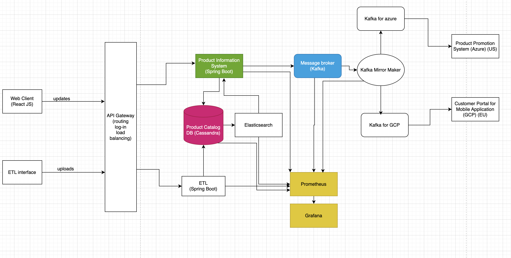
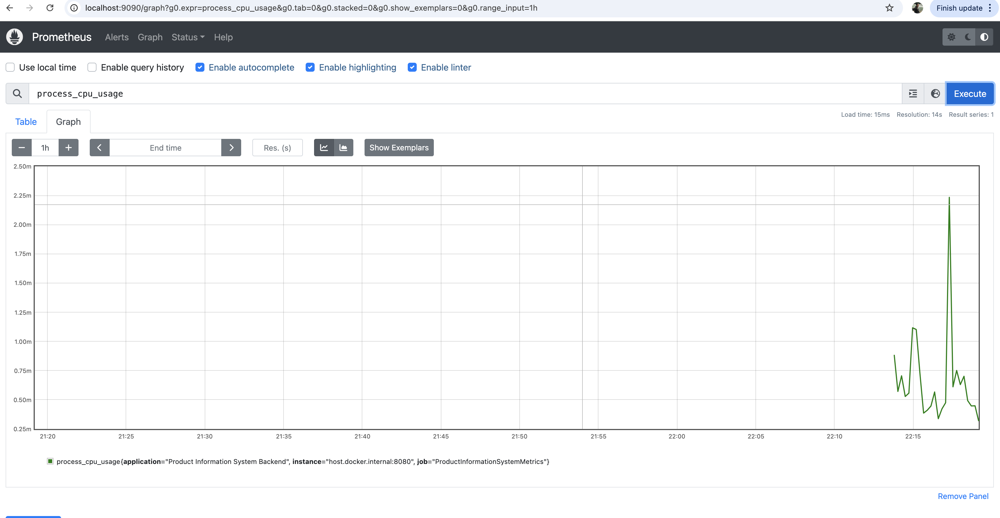
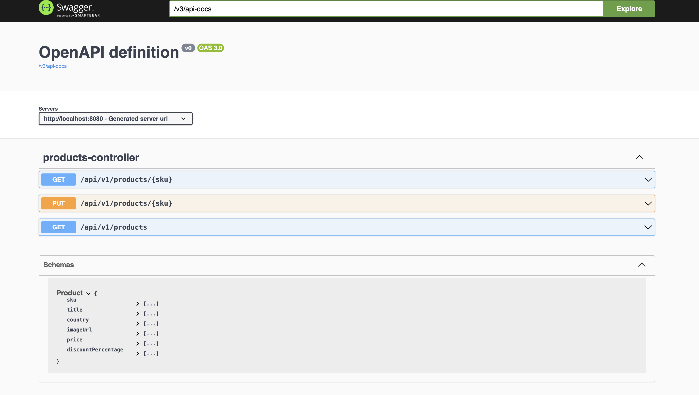

# Product Information System

The microservice for managing the products information and its updates. This application is the main `Producer` for events in our real time event based message exchange. 

It is marked as green box in the architecture diagram. 

This application also talks to the cassandra db (marked pink) to fetch and update the product information. For the cassandra db, for this assignment, I have used datastax astra DB free version. In a real life project we should use cloud of our own choice and configure the DB using IaC. To be able to connect to this DB, we need some credentials and secure-bundle.zip, once you have them you can run the application. 

This application acts as producer to the kafka broker (marked as blue) in the diagram. For the purpose of this assignment I have configured the broker on `aiven cloud` free subscription again. In a real life project this should also be configured using IaC, a brief idea of which I have put in [infrastructure repo](https://github.com/anshupitlia/event-based-message-exchange-infrastructure)

### Monitoring

An introductory connect with prometheus and grafana is configured via `docker-compose.yml` and using actuator api. 

 

### How to test & run this application

Testing: `mvn test`

Running: `mvn spring-boot:run`

I have also configured Dockerfile, to be able to ship it in a better way as container, and can be clubbed with container orchestration tools like kubernetes and run as pods and replicated. 

To run the application as container locally:

`docker build -t product-information-system .`

and then

`docker run -p 8080:8080 product-information-system`

As an improvement, we can include this too in `docker-compose` to start everything together when we do a `docker-compose up`. 

### CI/CD 

`Github Actions` has been configured to test, package and publish the application.

However, for this assignment, since we have created cassandra DB instance and kafka broker on cloud manually, and the connection mechanism along with credentials also involve files like secure-bundle.zip (which can't be checked for security reasons) and can not be directly uploaded to secrets in github actions (unlike username & password which can still be configured.), the pipeline is failing. In an ideal scenario, we would have better ways to manage this. But this sure gives an idea of how the application will be taken to prod in a real life project (clubbed with docker). 

### API versioning
Currently, the application is configured to use `/api/v1` for its endpoints. We can follow similar convention if any upgrade is needed.

### Swagger Endpoint
The documentation of the api can be found at [Swagger endpoint](http://localhost:8080/swagger-ui/index.html)

A little sneak peek: 

### Scope for improvement:
Given it is a take home assignment, there have been things which could not be covered in the timeframe and have been identified as improvements:

- While appropriate tests are added wherever necessary, we need to incorporate some `code coverage` mechanism with a `threshold` to verify and ensure further updates do not break things and quality is never compromised.
- `Logging` needs to be improved. 
- `Embedded cassandra` test was briefly tried, but wasn't very straightforward. It should be pursued for integration testing.  
- Currently, when any update happens, the update is saved to the DB and a kafka event is sent. Ideally, to maintain the data consistency this should be done as a transaction, using `outbox pattern`. Create a table for storing the event which happens along with updating the product in the database via a transaction and then having a listener listen to that outbox table send events to kafka. That way it will be consistent eventually and less error-prone.
- Pipeline needs to be worked upon esp around the `secure-bundle.zip` upload. 
- Security checks have currently not been put. Using `spring-security` those should be put in place. 
- Minor `refactoring in code` like way to organize producers for different topics etc. 

